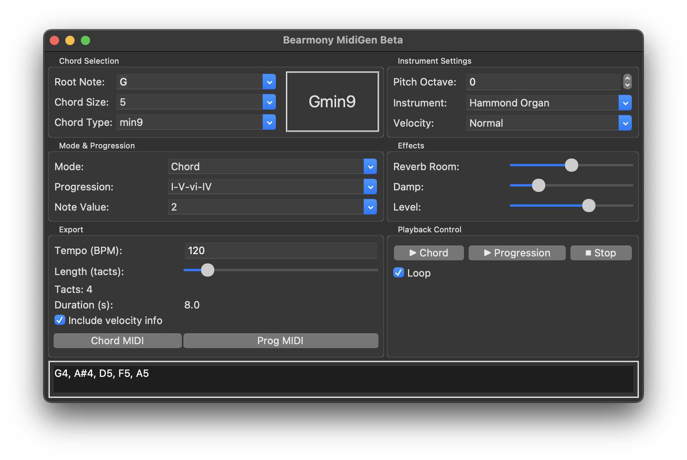
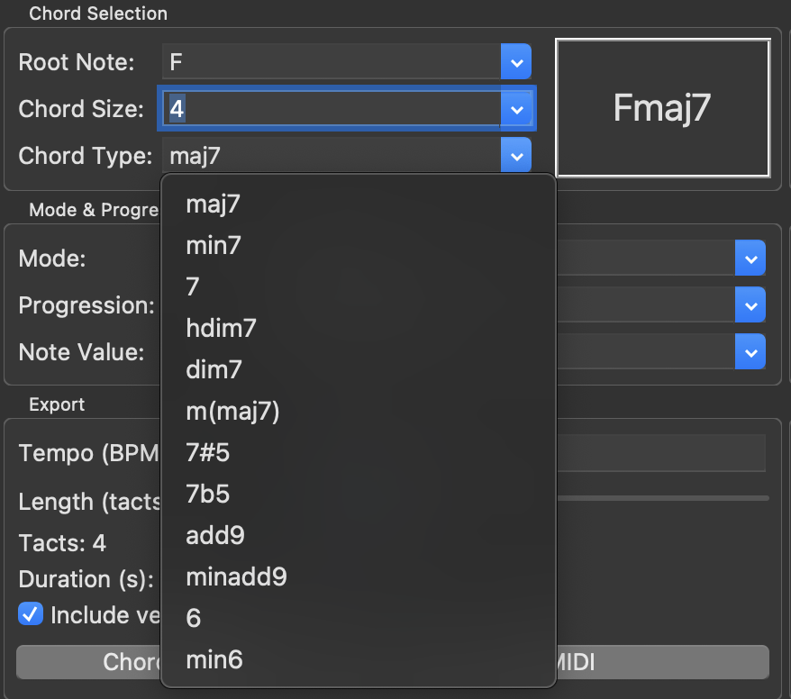
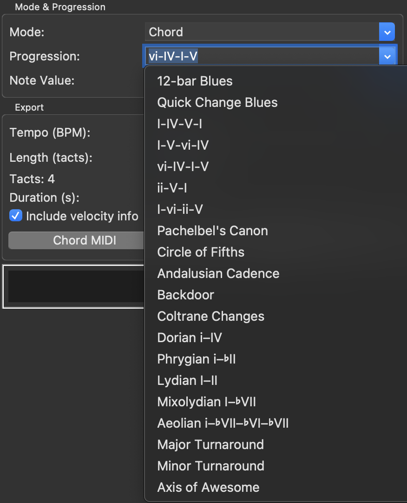
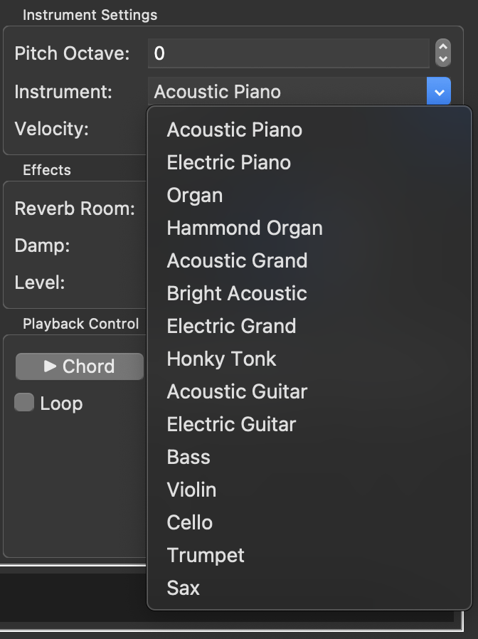
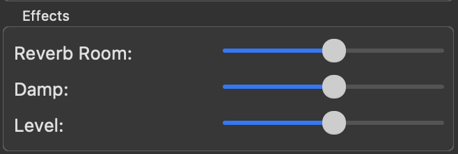
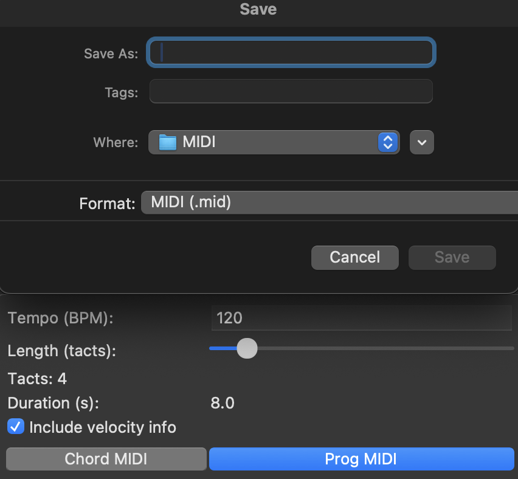

<div align="center" style="margin-bottom: 8px;">
  
  <span style="font-size:2em; font-weight:bold; vertical-align: middle;"></span>
</div>

**Bearmony MidiGen** – a simple program with a library of all musical chord and scale combinations, featuring real-time playback on various instruments and the ability to create MIDI files for songwriting.

<div align="center" style="margin-bottom: 24px;">
  
</div>

## UI Overview
- `Chord Selection:` Choose root note, chord size, and chord type
<div align="center" style="margin: 18px 0;" >
  
</div>

-  `Mode & Progression:`  Select playback mode, progression, and note value (all grouped together)

<div align="center" style="margin: 18px 0;" >
  
</div>

- `Instrument Settings:` Pick instrument, pitch octave, and velocity

<div align="center" style="margin: 18px 0;" >
  
</div>

- `Effects:` Reverb controls

<div align="center" style="margin: 18px 0;" >
  
</div>

- `Export:` Set tempo, tacts, and export MIDI

<div align="center" style="margin: 18px 0;" >
  
</div>


## Requirements
  * **FluidSynth**
    * macOS: `brew install fluid-synth`
    * Windows: install a FluidSynth runtime or place `fluidsynth.dll` next to the EXE

  * **Python dependencies:**
    * Install with `pip install -r requirements.txt`
    * Includes: mido, python-rtmidi, pyFluidSynth, Pillow, pyinstaller

  * **SoundFont (`.sf2`)**
    * Not included. Select your own soundfont from the program’s taskbar.

---


Free soundfonts you can download:
* https://musescore.org/en/handbook/3/soundfonts-and-sfz-files 
* https://chusocol.sourceforge.net/ 
* https://sites.google.com/site/soundfonts4u/
	
	
## Quick start
```bash
python3 -m venv .venv
# macOS/Linux
source .venv/bin/activate
# Windows (PowerShell)
# .\.venv\Scripts\Activate.ps1

python -m pip install --upgrade pip
pip install -r requirements.txt
python -m bearmony
```


## Build

### macOS (.app)

```bash
source .venv/bin/activate
pip install -r requirements.txt
pyinstaller --windowed --name Bearmony bearmony/__main__.py \
  --add-data "bearmony/data/chord_formulas.json:bearmony/data" \
  --add-data "bearmony/data/progressions.json:bearmony/data" \
  --add-data "bearmony/data/scales.json:bearmony/data" \
  --icon bearmony/assets/images/logo.icns
# Optional zip:
ditto -c -k --sequesterRsrc --keepParent dist/Bearmony.app dist/Bearmony-mac.zip
# Move the generated app to the main repository folder for easy access:
mv dist/Bearmony.app Bearmony.app
# Clean up build files after successful build (does not delete the app):
rm -rf build/ dist/ Bearmony.spec
```

### Windows (.exe)

```powershell
.\.venv\Scripts\activate
pip install -r requirements.txt
pyinstaller -F -w -n Bearmony bearmony\__main__.py `
  --add-data "bearmony\data\chord_formulas.json;bearmony\data" `
  --add-data "bearmony\data\progressions.json;bearmony\data" `
  --add-data "bearmony\data\scales.json;bearmony\data" `
  --icon bearmony\assets\images\logo.ico
# Clean up build files after successful build:
rm -rf build/ dist/ Bearmony.spec
```
## Download without building (currently not Available)
  
  * MacOS:    
    *  Bearmony.app (after build, the app is moved to the main repository folder)
  * Windows:  
    * BearmonyMidiGen.exe 


## Troubleshooting

* `No module named '_tkinter'`: use Python 3.11+ from python.org and recreate the venv.
* `No module named bearmony`: run from the project root with `python -m bearmony`.
* `No module named 'PIL'`: run `pip install Pillow` in your environment.

---

## License

DIY
